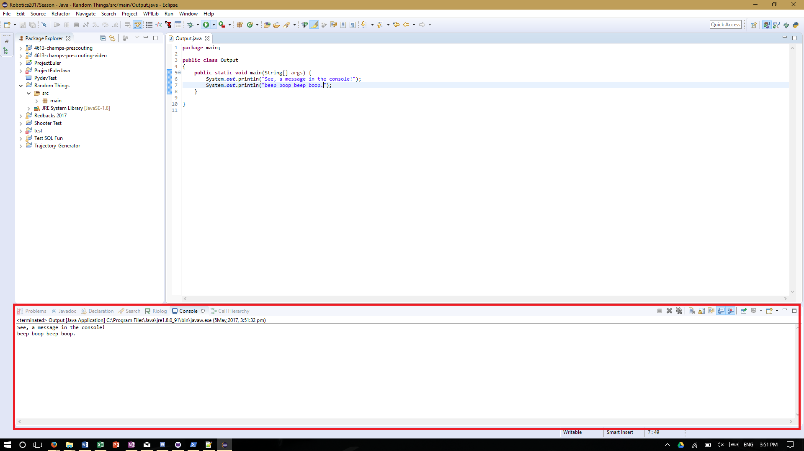
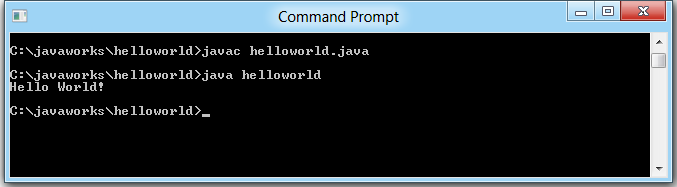

# Core elements of programs - Output

So, time to start programming!

An important ability for programs to do is output data. 
It allows us to see what the computer is doing, and do something useful with it.
A common way to output data is to send text to the console of where you are editing your code.
The console is just a text stream. In eclipse it'll be at the bottom of your window, like this:

But the console dosen't necessarily look like that, really it can look like any old text stream.
A common one is the cmd (command) prompt:


You can also output data in many many other ways, including through a GUI (graphical interface), over a network, over a speaker, through a robot, or whatever you really feel like.
But the console of where you are developing (in our case, Eclipse) is simple and easy, and what you'll generally use.

So *now* it's time to start programming.

To program:

1. In eclipse, you'll want to create a new Java Project (you know, to do Java in.) Go "Ctrl+N" or hit [this button](behind-the-scenes/Eclipse-new-java-project.png)
2. From that button go ```Java > Java Project > Next``` Give it a nice project name and click finish. You should see the new project appear.
3. Now you'll want to create a new class. Java likes to wrap everything in nice wrappings, and so all our code needs to be wrapped nicely in a class file (and these classes in a project). You'll learn more about classes in OOP. To create a new class:
4. Open up the new things window again (that's Ctrl+N). Select Class under Java.
5. Give your class a nice name. By convention Class names are UpperCamelCase (start of each word capitalized). No spaces!
6. Under the "Which method stubs would you like to create?" message tick ```public static void main(String[] args)```. Next!
7. You'll see a lot of junk in the file. We really weren't lying when we said Java likes to wrap things up. Trust us, it's not as insane as it sounds.

You should now have a file that looks something like:
```Java
public class OutputLesson
{

	public OutputLesson() {
		// TODO Auto-generated constructor stub
		// You may not have this bit, it depends on which boxes were selected. If you do have it, feel free to delete it, but it dosen't really matter
	}

	public static void main(String[] args) {
		// TODO Auto-generated method stub
		// This is where the code goes!

	}

}
```

see where it says ```public static void main(String[] args) {``` ? This is a special function (function's are just blocks of code that do things). Java always looks for this function and executes blocks of code inside of it. This is where we will initially be typing our code.

*Now we can start typing things*

In order to output to the console, write
```Java
System.out.println()
```
Note: Println() short for printline, make sure not to write print1. Also make sure you are writing the code inside the main function.
Inside the brackets, you'll need to add the thing you want to output to the console, in single or double quotation marks. This tells the computer that we are working with a String, or, line of text.
In Java, the end of every line should have a semicolon (to mark the end of a line.) Add a semicolon (";") too!

You *should* have a finished program now Click run to start it [(this button)](behind-the-scenes/Eclipse-run.png)

if it didn't work, my sample code is [here](behind-the-scenes/2.1.-output-sample-code.md)

## Activities

1. Try changing the message to whatever you want!
2. Try doing a number
3. Try doing a number *without quotes (gasp. The humanity.)*
4. Try doing a sentence *without quotes. Again! un-boh-livable.* It won't work, but read through the error message and see what it says.
5. You can add together elements to print them with a + sign between things like strings and integers ("Pot"+"ato"). Try printing multiple separate Strings.
